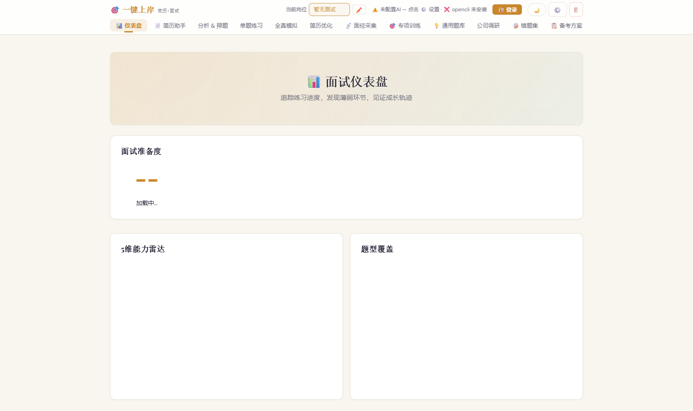
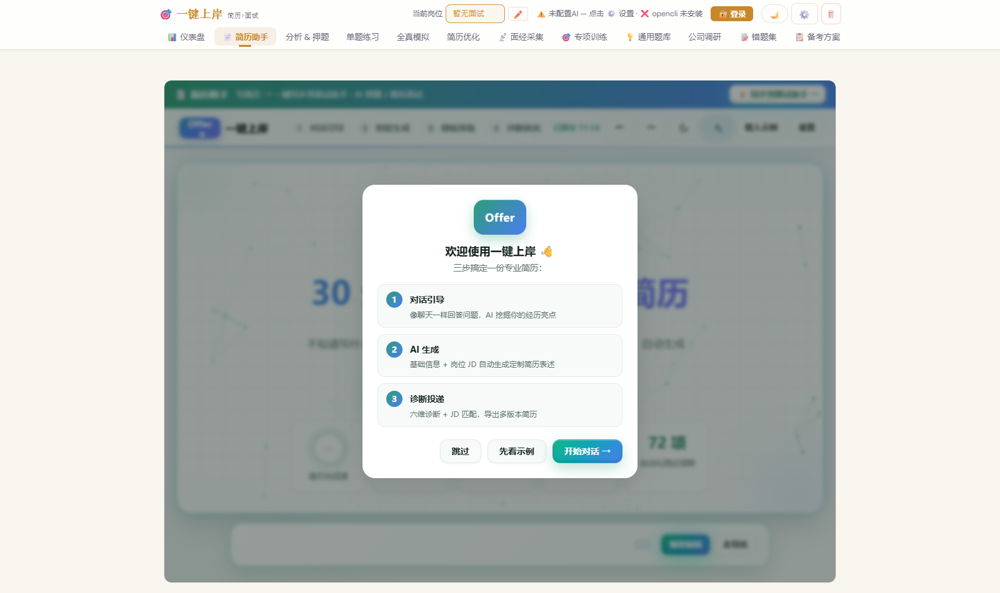
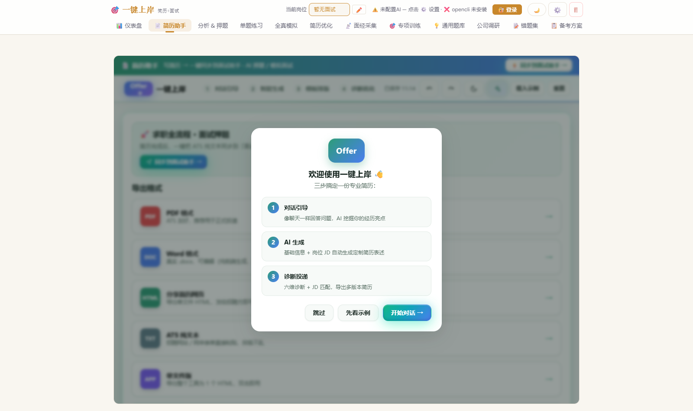
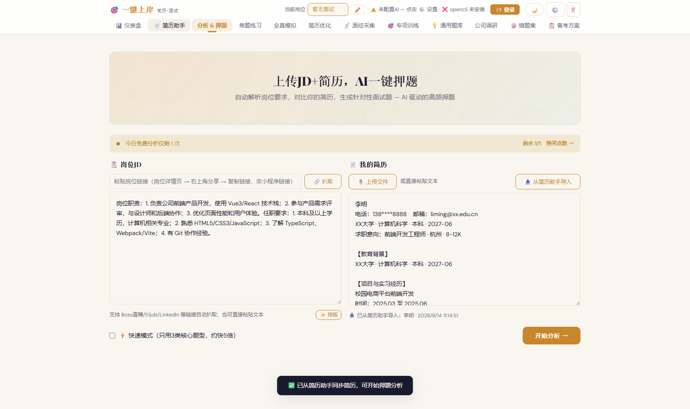
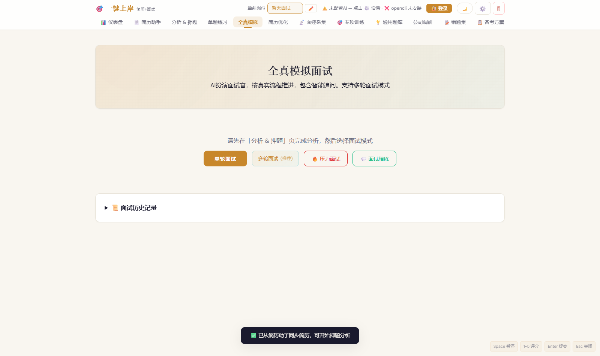
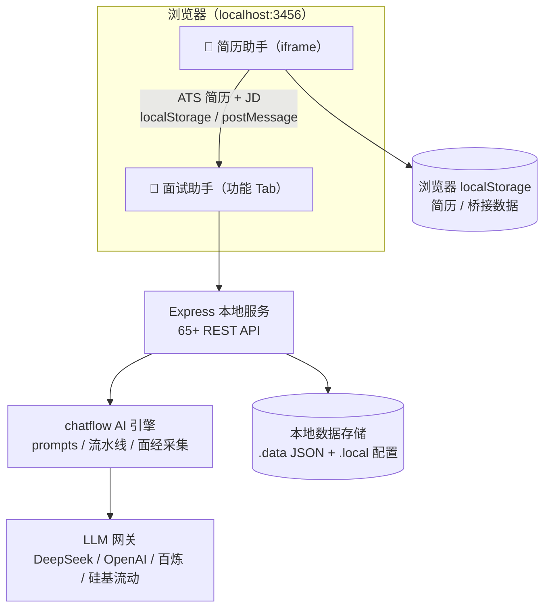

<div align="center">

# 🎯 一键上岸（One-Click Shang’an）

### AI 求职 Agent · 简历助手 + 面试助手

**写简历 → AI 押题 → 全真模拟面试 → 简历优化 → 拿 Offer**

[](https://nodejs.org)
[](https://expressjs.com)
[](https://developer.mozilla.org/zh-CN/docs/Web/JavaScript)
[](https://echarts.apache.org)
[](https://www.electronjs.org)
[](#-系统架构)
[](#-实测结果)
[](LICENSE)

</div>

---

## 📑 目录

- [✨ 功能特性](#-功能特性)
- [📸 界面预览](#-界面预览)
- [🏗️ 系统架构](#️-系统架构)
- [🚀 快速开始](#-快速开始)
- [🗂️ 项目结构](#️-项目结构)
- [🧪 实测结果](#-实测结果)
- [🛠 技术栈](#-技术栈)
- [🔒 数据与隐私](#-数据与隐私)
- [📝 更新日志](#-更新日志)
- [📄 License](#-license)

---

## ✨ 功能特性

### 📄 简历助手（纯前端本地版）

- 🤖 **AI 对话式引导**：像学长一样提问，30 分钟挖掘经历亮点，自动生成专业简历
- 🎨 **11 套模板 + 实时排版**：主色调 / 字号 / 行距 / 照片开关，自动检测单页溢出
- 🩺 **六维诊断**：内容完整性 / 表述专业度 / 量化程度 / ATS 兼容 / 岗位匹配 / 排版规范
- 📤 **多格式导出**：PDF / Word（真实 .docx）/ 分享网页 / ATS 纯文本 / JSON 备份
- 🔌 **零依赖可用**：内置确定性 AI 引擎，无需服务器与 API Key

### 🎯 面试助手（AI 押题与模拟面试官）

- 🔍 **分析 & 押题**：JD 解析 → 简历解析 → 差距分析 → 五类题型并行生成（支持 Boss直聘 / 51job 链接扒取、快速模式）
- 💪 **单题练习**：五维深度评分、逐句点评、AI 标准答案、话术库收藏
- 🎤 **全真模拟面试**：多阶段追问 + 五维雷达图 + 逐题点评报告
- 👥 **群面模拟**：无领导小组讨论，3 位 AI 候选人角色扮演
- 📡 **面经采集**：小红书面经搜索 + OCR + LLM 结构化提取
- 🎯 **专项训练 / 错题集 / 备考方案 / 公司调研 / 面试复盘**
- 📊 **仪表盘**：准备度评分、练习热力图、雷达图、题型覆盖饼图

### 🔗 简历 → 面试 一键贯通

- 简历助手与面试助手**同源同域**运行，简历 ATS 文本 + JD 一键同步到「分析 & 押题」
- 数据经 `localStorage + postMessage` 本机流转，**无需重复粘贴、不上传云端**

---

## 📸 界面预览

| | |
|---|---|
|  |  |
|  |  |



---

## 🏗️ 系统架构



---

## 🚀 快速开始

### 环境要求

- [Node.js](https://nodejs.org) ≥ 18
- Chrome / Edge 浏览器（推荐最新版）

### 安装与启动

```bash
git clone https://github.com/Tazz-zhu/one-click-shangan.git
cd one-click-shangan
npm install
npm start
# 浏览器打开 http://localhost:3456
```

### Windows 一键启动

```powershell
powershell -ExecutionPolicy Bypass -File start.ps1
```

### 首次使用

1. 打开「📄 简历助手」，完成一份 ATS 友好简历
2. 点「⚡ 同步到面试助手」，简历与 JD 自动带入
3. 在「分析 & 押题」确认 / 粘贴 JD 后点「开始分析」
4. 在 ⚙️ 设置中配置 AI 供应商（DeepSeek / OpenAI / 阿里百炼 / 硅基流动）

---

## 🗂️ 项目结构

```
one-click-shangan/
├── server.js                 # Express 主服务（65+ API 路由）
├── chatflow/                 # AI 引擎核心
│   ├── engine.js             # 分析流水线编排
│   ├── prompts.js            # 20+ System Prompt 模板
│   ├── ai-provider.js        # AI 供应商桥接（LLM 网关）
│   ├── resume-parser.js      # 简历文件解析
│   ├── export-docx.js        # DOCX 导出
│   └── nodes/                # 面经采集 / 公司调研 / OpenCLI
├── public/                   # 前端 SPA
│   ├── index.html            # 主页面（简历助手 Tab + 11 个功能 Tab）
│   ├── app.js / style.css    # 前端逻辑与亮暗双主题样式
│   ├── resume-agent/         # 内嵌「一键Offer 简历助手」（纯前端）
│   └── echarts.min.js        # ECharts 图表
├── knowledge/                # 知识库（行为面试 / 群面 / STAR 框架）
├── electron/                 # Electron 桌面端（可选打包）
├── scripts/                  # 工具脚本（同步简历助手源码）
├── assets/screenshots/       # README 界面截图
├── tests/                    # 端到端 / 贯通测试（Playwright）
└── .data/                    # 本地数据（运行时生成，不入库）
```

---

## 🧪 实测结果

| 测试套件 | 覆盖内容 | 结果 |
|---|---|---|
| 简历助手 单元 + 冒烟测试 | 对话引导 / 生成 / 模板 / 诊断 / JD / 导出 / 移动端 | ✅ **132/132** |
| 集成端到端测试 | 品牌 / Tab / iframe / 一键同步 / 手动导入 / 独立模式 | ✅ **20/20** |
| 简历 → 面试贯通测试 | 真实点击流：载入示例 → 同步 → 自动填入 | ✅ **11/11** |

```bash
# 简历助手测试（132 项）
cd ai-resume-agent && npm install && npm test

# 集成端到端测试（20 项）
cd interview-prep && npm run test:e2e

# 简历 → 面试贯通测试（11 项）
cd interview-prep && node tests/bridge-live.mjs
```

---

## 🛠 技术栈

| 层 | 技术 |
|---|---|
| 前端 | 原生 HTML / CSS / JavaScript SPA（零框架依赖）+ ECharts 图表 |
| 后端 | Node.js + Express（本地服务，可选 Electron 桌面端） |
| AI | 多供应商接入：DeepSeek / OpenAI / 阿里百炼 / 硅基流动（OpenAI 兼容网关） |
| 存储 | 本地 JSON 文件 + 浏览器 localStorage（无数据库、无云端） |
| 测试 | Playwright 端到端 + 单元测试（163 项通过） |

---

## 🔒 数据与隐私

- 简历、JD、面试记录、账号数据**全部保存在本机**：服务器写入 `.data/` / `.local/` JSON 文件，浏览器数据写入 localStorage
- 无云端数据库、无埋点上报；`.data` / `.local` / `logs` 均被 `.gitignore` 排除，不会上传到仓库
- 删除 `interview-prep/.data` 与 `.local` 即可彻底清除服务端本地数据

---

## 📝 更新日志

### v1.0.0 (2026-08-14)

- 🎯 首个版本：AI 求职 Agent（简历助手 + 面试助手）
- 📄 简历助手：AI 对话引导写简历、模板排版、六维诊断、岗位匹配、PDF / Word / HTML / ATS 导出
- 🔗 简历 → 面试一键同步：ATS 纯文本 + JD 自动带入「分析 & 押题」
- 🔍 分析 & 押题 / 单题练习 / 全真模拟面试 / 面经采集 / 群面模拟 / 专项训练 / 公司调研
- 🛡️ 数据本地化：账号、面试记录、简历全部保存在本机
- ✅ 质量验证：简历助手 132 项 + 集成 20 项 + 贯通 11 项测试全部通过

---

## 📄 License

MIT © [Tazz-zhu](https://github.com/Tazz-zhu)
